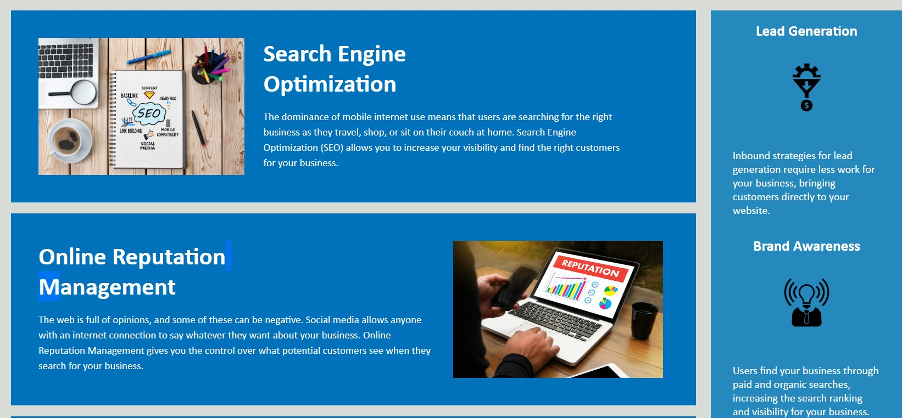
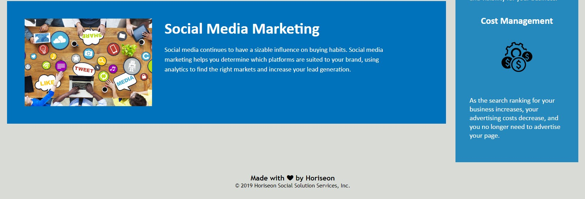

# code-refractor
I went throught this project by addressing each of the acceptance criteria one at a time.

I first went through and added the semantic elements. I then went through and made sure that everything was structured logically. I also added accessability by including alt and title tags (on the background since there is no alt attributes for backgrounds as far as I could tell.)

The headings should be in order. I wasn't sure about the footer, so I changed that to be a h3 tag. I believe that Horiseon SEO is a good title to at least include something about what the company does.

After all this, I moved on to style to match the image on the course requirements page. I wasn't sure about the footer being visible, since it's not on the mock-up, but I included it anyway since it seems like a good practice. I wasn't able to get the font to match, but I think everything else looks like what they're asking for.

